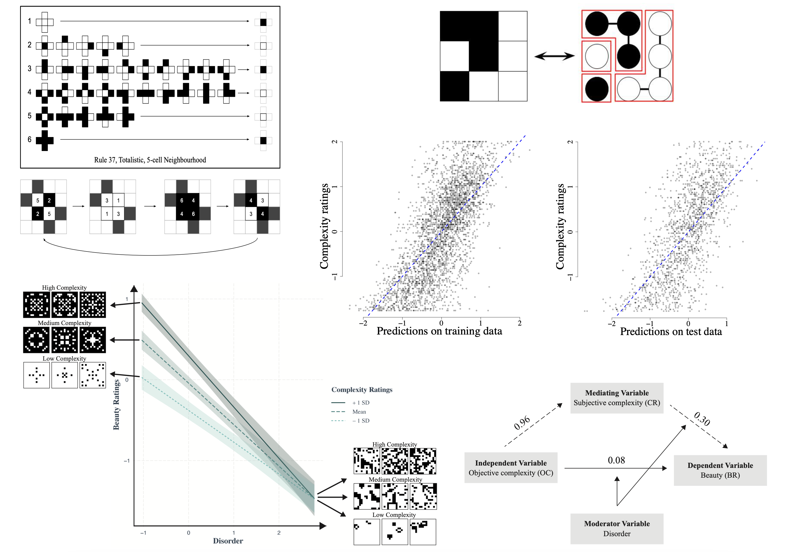

# Relating Objective Complexity Subjective Complexity and Beauty in Binary Pixel Patterns
[](https://www.python.org)
[](https://jupyterlab.readthedocs.io/en/stable)
[](https://cran.r-project.org)
[](https://www.rstudio.com)

This repository contains the data and scripts for the paper [Relating Objective Complexity, Subjective Complexity and Beauty in Binary Pixel Patterns](https://psyarxiv.com/nuep7/) accepted at [PACA](https://www.apa.org/pubs/journals/aca). 
Authors: [Surabhi S Nath](https://surabhisnath.github.io), [Franziska Brändle](https://www.kyb.tuebingen.mpg.de/person/104445/250676), [Eric Schulz](https://www.kyb.tuebingen.mpg.de/person/103915), [Peter Dayan](https://www.mpg.de/12309357/biologische-kybernetik-dayan)#, [Aenne Brielmann](https://www.kyb.tuebingen.mpg.de/person/58620/2549)# (# indicates equal contribution)

## Abstract

The complexity of images critically influences our assessment of their beauty. However, studies relating assessments of complexity and beauty to potential objective measures are hampered by the use of hand-crafted stimuli which are hard to reproduce and manipulate. To tackle this, we developed a systematic method for generating 2D black-and-white pixel patterns using cellular automata, and collected ratings of complexity and beauty from 80 participants. We developed various computational measures of pattern quantification such as density, entropies, local spatial complexity, Kolmogorov complexity, and asymmetries. We also introduced an “intricacy” measure quantifying the number of components in a pattern using a graph-based approach. We related these objective measures with participant judgements of complexity and beauty to find that a weighted combination of local spatial complexity and intricacy was an effective predictor (R2test = 0.47) of complexity. This implies that people’s complexity ratings depended on the local arrangement of pixels along with the global number of components in the pattern. Furthermore, we found a positive linear influence of complexity ratings on beauty, with a negative linear influence of disorder (asymmetry and entropy), and a negative interaction between the two quantities (R2test = 0.65). This implies that there is beauty in complexity as long as there is sufficient order. Lastly, a moderated mediation analysis showed that subjective complexity mediates the influence of objective complexity on beauty, implying that subjective complexity provides useful information over and above objective complexity.



## Respository Description

The repository contains the following folders:
- **data**: contains the processed .csv data files from 80 participants. Each file has 6 columns indicating the pattern number, complexity reponse (0-100), beauty response (0-100), reaction time (ms), is_repeated flag which indicates if the pattern is repeated (6 patterns were repeated for each participant) and trial number. The dictionary mapping pattern names to pattern numbers is provided in `scrips/utils/pattern_to_num.pk`. The data folder also has info.csv which stores participant details such as dmeographics, open-ended reponses, number of attention checks presented/failed and total time taken.
- **figures**: contains all the figures in the main paper as PDFs.
- **generator**: `generator/cellular_automata.py` is the stimuli generation script. Generates 2 folders `generator/stimuli/` containing all stimuli and `generator/gifs/` containing stimuli evolutions saved as .gif files.
- **measures**: this folder contains implementations of all pattern quantification measures described in Section 2.2 in the paper. 
- **patterns**: contains all the patterns used in the experiment in the folder `15by15`. `instructions` folder contains the patterns used in the task description, `attentioncheck` folder consists of the patterns which were used as attention checks. `experiment` folder consists of 4 sets each with 54 patterns used in the experiment.
- **scripts**: contains analysis scripts `DescriptiveAnalysis.ipynb` and `MixedEffectsModelling.R`. Plots and model fits are stored in `plots` and `model_fits` respectively.

## Setup

We recommend setting up a python virtual environment and installing all the requirements. Please follow these steps:

```bash
git clone https://github.com/surabhisnath/Relating_ObjectiveComplexity_SubjectiveComplexity_Beauty_BinaryPixelPatterns.git
cd Relating_ObjectiveComplexity_SubjectiveComplexity_Beauty_BinaryPixelPatterns

python3 -m venv .env

# On macOS/Linux
source .env/bin/activate
# On Windows
.env\Scripts\activate

pip install -r requirements.txt
```

## Running the code

To reproduce the plots from the paper, run 
```bash
jupyter-lab
```
and open the file `scripts/DescriptiveAnalysis.ipynb`. 

On running the file (either in one go or cell by cell), all plots are saved to scripts/plots/ folder and also displayed in the notebook for easier viewing.

To reproduce the model fits from the paper
- Ensure you have a working R installation
- Install the required libraries
  - *E.g.*, `install.packages(c("lme4", "ggplot2", "interactions", "dplyr", "mediation", "lmerTest"))` from an R console
- Run `MixedEffectsModelling.R`
```R
setwd('/path/to/Relating_ObjectiveComplexity_SubjectiveComplexity_Beauty_BinaryPixelPatterns/scripts')
source("process.R")
source("MixedEffectsModelling.R")
```
On running the file, all plots are saved to scripts/plots/ folder and tables are saved to model_fits/.
Lines printed on the terminal can largely be ignored.


## Citation

If you found this work useful, please consider citing us:

```
@article{nath2023relating,
  title={Relating Objective Complexity, Subjective Complexity and Beauty},
  author={Nath, Surabhi S and Br{\"a}ndle, Franziska and Schulz, Eric and Dayan, Peter and Brielmann, Aenne Annelie},
  year={2023},
  publisher={PsyArXiv}
}
```

## Contact

Please feel free to email us at surabhi.nath@tuebingen.mpg.de
